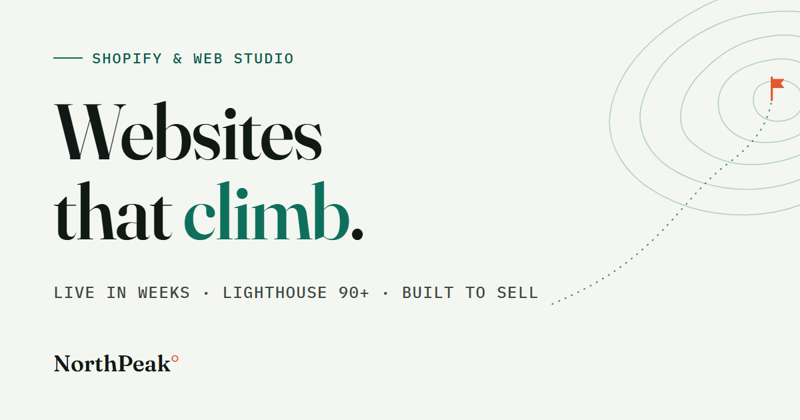

# NorthPeak Digital — a one-page agency site



A responsive one-page website for **NorthPeak Digital**, a fictional web & Shopify studio —
built for the **Digital Heroes internship qualification task (Web Development, Tasks A + B)**.

- **Live site:** https://northpeak-digital.netlify.app <!-- update if the site name changes -->
- **Lighthouse:** mobile **99 / 100 / 100 / 100** · desktop **100 / 100 / 100 / 100**
  ([reports](docs/lighthouse/) · [optimization changelog](OPTIMIZATION-CHANGELOG.md))

## The concept: the page is an ascent

Most agency one-pagers are a stack of unrelated sections. This one has a spine: **you climb
it.** Every section eyebrow is a waypoint with an elevation — basecamp (hero, 0 m) through
services (1,400 m), results (2,600 m), pricing (3,500 m), FAQ (4,200 m) — and the contact
form is the summit (4,810 m). On desktop, a fixed altitude rail tracks the climb live and
plants a safety-orange flag when you reach the form. Structure encoding meaning: scrolling
toward conversion *is* the ascent.

Design system: cool "snowfield" paper (`#f4f6f1`), spruce ink, one glacier-teal accent, and
safety-orange in exactly two places (the ° in the wordmark, the summit flag). Type is
Fraunces (editorial display) + Instrument Sans (body) + IBM Plex Mono (instrument readouts).

## Brief coverage (Task A)

| Requirement | Where |
| --- | --- |
| Hero with headline + CTA | `components/Hero.tsx` — dual CTA, expedition-manifest stats |
| Services grid of 6 | `components/Services.tsx` — ruled grid, honest starting prices |
| Results / testimonials | `components/Results.tsx` — both: metrics *and* quotes |
| Pricing with 3 tiers | `components/Pricing.tsx` — Basecamp / Ascent / Summit |
| Contact form + client-side validation | `components/ContactForm.tsx` — see below |
| Intentional at 360 / 768 / 1440 | fluid type + grids; verified with `scripts/shots.mjs` |
| Deployed + public repo | Netlify (static export) + this repo |

**The form is real.** Client-side validation (accessible errors: `aria-invalid`,
`aria-describedby`, focus moves to the first invalid field, errors clear as you type) and
real submissions via **Netlify Forms** — no backend code. There's a honeypot for bots, a
no-JS fallback (`/thanks`), and an explicit failure state with a mailto escape hatch.

## Stack, and why

**Next.js 16 (App Router, TypeScript) with `output: 'export'`** — every route pre-renders
to static HTML served from Netlify's CDN. React powers the interactive islands (menu, form,
scroll effects); there is no server to be slow.

**Every line of CSS is hand-written** (`app/globals.css`) — design tokens, fluid
`clamp()` type, grid layouts, focus states, reduced-motion handling. No Tailwind, no UI
kit: the brief tests hand-built layout and semantic code, so the CSS is the point.

**Semantics & accessibility:** landmarks, one `h1`, ordered headings, skip link,
`aria-expanded` on the menu, native `<details>` for the FAQ (works with JS disabled),
WCAG AA contrast throughout, ≥24px targets, `prefers-reduced-motion` respected, and reveal
effects gated so content is never hidden without JS.

## Performance

The full story with measured before/after numbers is in
[OPTIMIZATION-CHANGELOG.md](OPTIMIZATION-CHANGELOG.md). Headlines: self-hosted fonts via
`next/font` (FCP 3.5 s → 0.9 s), an LCP-safe hero animation (never fade the largest
element), zero third-party requests, all artwork inline SVG, CLS 0.

## Run it

```bash
npm install
npm run dev        # http://localhost:3000
npm run build      # static export to /out
npx serve out      # preview the production build
```

Dev-only helpers: `node scripts/shots.mjs` (viewport screenshots at 360/768/1440 across all
sections) · `node scripts/og.mjs` (regenerates the Open Graph card).

## Project structure

```
app/            layout (fonts + metadata), page, /thanks fallback, global CSS, icon
components/     Header, Hero, TopoArt, Clients, Services, Results, Pricing,
                Faq, Contact, ContactForm, Footer, AscentRail, ScrollFx
scripts/        shots.mjs, og.mjs (authoring-time helpers, not shipped)
docs/           Lighthouse reports, Loom script, submission checklist
netlify.toml    build config, long-cache + security headers
```

## AI usage (per the task rules)

I built this with Claude (Claude Code) as a pair-programmer, working under my direction.
The calls that shaped the result were mine: the stack (Next.js static export over vanilla
or Astro), the visual direction (light "Alpine Editorial" — deliberately against the dark
agency-site default), the ascent/waypoint concept, the pricing structure, and the tone of
the copy. AI drafted code and copy against those decisions; I reviewed the output,
requested changes where it missed (grid list-style bugs, the Summit price wrapping, topo
art that first rendered like radar rings), and we measured everything with Lighthouse
before and after each optimization rather than trusting first output. The optimization
changelog documents that loop honestly — including the LCP regression my own entrance
animation caused, and the fix.

## Credit

NorthPeak Digital is a fictional studio created for this exercise.
Built by **Akhil Chiluvari** for the
[Digital Heroes Training Task](https://digitalheroesco.com) — the required credit line
also appears in the site footer.
